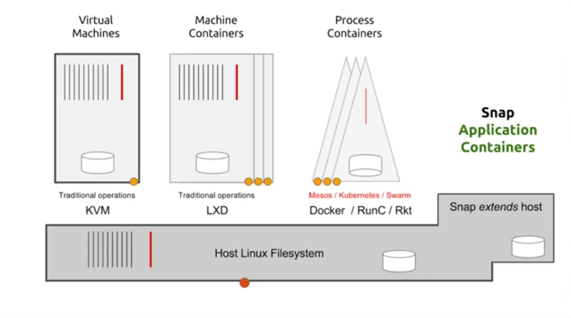

# LXD Introduction and Installation

Sources:
- ✅ [Run system containers with LXD](https://ubuntu.com/lxd)
- ✅ [LXD Docs](https://documentation.ubuntu.com/lxd/en/latest/tutorial/first_steps/)
- ✅ [LXD Github](https://github.com/canonical/lxd)
- ✅ [LXD 2.0: Blog post series](https://stgraber.org/2016/03/11/lxd-2-0-blog-post-series-012/)
- ✅ [Containers - LXD](https://ubuntu.com/server/docs/containers-lxd)
- ✅ [About lxd and lxc](https://documentation.ubuntu.com/lxd/en/latest/explanation/lxd_lxc/#lxd-lxc)
- ✅ [About containers and VMs](https://documentation.ubuntu.com/lxd/en/latest/explanation/containers_and_vms/#containers-and-vms)
- ✅ [About instances](https://documentation.ubuntu.com/lxd/en/latest/explanation/instances/)


## LXD Introduction

LXD (`lɛks'di:`) is a modern, secure and powerful **container and virtual machine manager**, also sometimes referred to as "lightervisor" (lightweight hypervisor).

It provides a unified experience for running and **managing full Linux systems** inside containers or virtual machines. LXD supports images for a large number of Linux distributions (official Ubuntu images and images provided by the community) and is built around a very powerful, yet pretty simple, REST API. 

LXD scales from one instance on **a single machine to a cluster** in a full data center rack, making it suitable for running workloads both for development and in production.

LXD allows you to easily set up a system that feels like a small private cloud. You can run any type of workload in an efficient way while keeping your resources optimized.

You should consider using LXD if you want to containerize different environments or run virtual machines, or in general run and manage your infrastructure in a cost-effective way.

> **[LXD is now under Canonical](https://linuxcontainers.org/lxd/)** Canonical, the creator and main contributor of the LXD project has decided that after over 8 years as part of the Linux Containers community, the project would now be better served directly under Canonical’s own set of projects.

LXD provides **a better user experience to LXC** by building on top of LXC. LXD uses `liblxc` and its Go language bindings to create and manage containers.

> Quick differences between VM, LXC/LXD, Docker and Snap:
> 
> To sum it up in short:
> - LXC/LXD are “machine containers” with a persistent filesystem that works like a VM
> - Docker are “process containers” with an overlay filesystem over a static image (with options for persistent storage)
> - Snaps are “application containers” that directly extends functionality of the underlying host


### Releases

The current LTS releases are `LXD 5.0.x` (snap channel 5.0/stable) and `LXD 4.0.x` (snap channel 4.0/stable).
- The latest available version of the LXD package in Ubuntu is `5.20` (April 2024).

> Note: LXD in now under Canonical and LinuxContainers.org's has created an Incus fork. This brings some incompatibilities (e.g., linuxcontainers image: server not working with LXD). This will be addressed in later leases.

The LTS releases **follow the Ubuntu release schedule and are released every two years**:
- `LXD 5.0` is supported until June 2027 and gets frequent bugfix and security updates, but does not receive any feature additions. Updates to this release happen approximately every six months, but this schedule should be seen as a rough estimation that can change based on priorities and discovered bugs.
- `LXD 4.0` is supported until June 2025.
- `LXD 6.0` is planned for April 2024 and will be supported until June 2029.

LTS releases are recommended for production environments, because they benefit from regular bugfix and security updates. However, there are no new features added to an LTS release, nor any kind of behavioral change.


### About LXD and LXC

LXD and LXC are two distinct implementations of Linux containers.
- **LXC** is a low-level user space interface for the Linux kernel containment features. It consists of tools (lxc-* commands), templates, and library and language bindings.
- **LXD** is a more intuitive and user-friendly tool aimed at making it easy to work with Linux containers. It is an alternative to LXC’s tools and distribution template system, with the added features that come from being controllable over the network. Under the hood, LXD uses LXC to create and manage the containers. LXD provides a superset of the features that LXC supports, and it is easier to use. Therefore, if you are unsure which of the tools to use, you should go for LXD. LXC should be seen as an alternative for experienced users that want to run Linux containers on distributions that don’t support LXD.


### LXD Daemon and LXD Client

The central part of LXD is its daemon. It runs persistently in the background, manages the instances, and handles all requests. The daemon provides a REST API that you can access directly or through a client (for example, the default command-line client that comes with LXD).

LXD is frequently confused with LXC, and the fact that LXD provides both a `lxd` command and a `lxc` command doesn’t make things easier.

> **Somewhat confusingly, LXD also provides an lxc command. This is different from the lxc command in the LXC package.**
> Note: all LXC command line tools are named `lxc-*`, while LXD tools are called `lxd` (daemon) and `lxc` (client). Note that there is no dash in the latter.

To control LXD, you typically use two different commands: lxd and lxc.
- **LXD daemon**
    - The `lxd` command controls the LXD daemon. Since the daemon is typically started automatically, *you hardly ever need to use the lxd command*. An exception is the `lxd init` subcommand that you run to initialize LXD.
    - There are also some subcommands for debugging and administrating the daemon, but they are intended for advanced users only.
- **LXD client**
    - The `lxc` command is a command-line client for LXD, which you can use to interact with the LXD daemon. You use the lxc command to manage your instances, the server settings, and overall the entities you create in LXD.
    - The lxc tool is not the only client you can use to interact with the LXD daemon. You can also use the API, the UI, or a custom LXD client.


### LXD Containers and Virtual Machines

LXD provides support for two different types of instances: system containers and virtual machines.

- When running a **system container**, LXD simulates a virtual version of a full operating system. To do this, it uses the functionality provided by the kernel running on the host system. You should **use a system container** to leverage the smaller size and **increased performance** if all functionality you require is compatible with the kernel of your host operating system.

- When running a **virtual machine**, LXD uses the hardware of the host system, but the kernel is provided by the virtual machine. Therefore, virtual machines can be used to run, for example, a different operating system. If you need functionality that is not supported by the OS kernel of your host system or you want to run a completely different OS, use a virtual machine.
    - LXD uses QEMU with Q35 UEFI layout and SecureBoot by default under the hood.
    - All devices are virtio-based (no complex device emulation at the host level). 
    - Main difference from other VM tools is in pre-installed image offerings and uniform management interface (same as with containers).


> We are only going to work with containers in this course.


## LXD Installation and Initialization

Sources:

- ✅ [How to install LXD](https://documentation.ubuntu.com/lxd/en/latest/installing/)

### LXD Installation

The easiest way to install LXD is to install the snap package.
- Run `snap version` to find out if snap is installed on your system:
    - If you see a table of version numbers, snap is installed and you can continue with the next step of installing LXD. Otherwise install snap using the online documentation for your distribution.
        ```bash
        # example: snap installation on ubuntu
        sudo apt update
        sudo apt install snapd
        ```
- Enter the following command to install LXD: `sudo snap install lxd`
    - If you get an error message that the snap is already installed, run the following command to refresh it and ensure that you are running an up-to-date version: `sudo snap refresh lxd`
    - If snap is already installed and you want to install the latest stable version of LXD, run the following commands:
        - `sudo snap remove lxd`
        - `sudo snap install lxd`
- Check the installed snaps: `snap list`. You should see an output like:
    ```bash
    Name      Version         Rev    Tracking         Publisher   Notes
    lxd       5.19-8635f82    26200  latest/stable    canonical✓  -
    snapd     2.60.4          20290  latest/stable    canonical✓  snapd
    ...
    ```
- Check the version of LXD that you have installed: `lxd --version`
- Note the `Tracking` channel in `snap list` output. By default snap will automatically track the latest/stable channel and **will enable automatic snap updates**. In the case of LXD, this can be problematic because **all machines of a cluster must use the same version of the LXD snap**. Therefore, you should schedule your updates and make sure that all cluster members are in sync regarding the snap version that they use.
    - To prevent this behavior, you can manually hold the package updates using `sudo snap refresh --hold lxd` command.
    - When you choose to update your installation, use the following commands to remove the hold, update the snap, and hold the updates again:
        ```bash
        sudo snap refresh --unhold lxd
        sudo snap refresh lxd --cohort="+" # this flag ensures that all machines in a cluster see the same snap revision and are therefore not affected by a progressive rollout (lxd snap is a progressive release deployed to smaller number of users at first)
        sudo snap refresh --hold lxd
        ```
        > You can check snap refresh (update) timer using `sudo snap refresh --time` and alter its settings using `sudo snap set system refresh.timer=4:00-7:00,19:00-22:10`

For additional details on managing the LXD snap package, see [Manage the LXD Snap](./manage_lxd_snap.md).

> To restart LXD installed via snap, use:
> - `sudo systemctl restart snap.lxd.daemon`

### LXD Initialization

Sources:
- ✅ [How to initialize LXD](https://documentation.ubuntu.com/lxd/en/latest/howto/initialize/)

Before you can create a LXD instance, you must configure and initialize LXD. The following command is used to initialize LXD: `lxd init`. It allows for the configuration of:

- Directory or ZFS container backend. If you choose ZFS, you can choose which block devices to use, or the size of a file to use as backing store.
- Availability over the network.
- A ‘trust password’ used by remote clients to vouch for their client certificate.

> For simple configurations, you can run this command as a normal user. However, some more advanced operations during the initialization process (for example, joining an existing cluster) require root privileges. **In this case, run the command with sudo or as root.**

> Further LXD client commands `lxc` can be run as any user who is a member of group lxd. You can add users to the lxd group using the following command: `adduser <user> lxd`. Because group membership is normally only applied at login, you might need to either re-open your user session or use the `newgrp lxd` command in the shell you’re using to talk to LXD.
> Additional resources:
> - https://documentation.ubuntu.com/lxd/en/latest/installing/#manage-access-to-lxd
> - https://documentation.ubuntu.com/lxd/en/latest/explanation/security/#security-daemon-access

Run the following command to start the **interactive configuration process**:
```bash
sudo lxd init
```

The tool asks a series of questions to determine the required configuration. The questions are dynamically adapted to the answers that you give. They cover the following areas:
- **Clustering**: A cluster combines several LXD servers.The default answer is `no`, which means clustering is not enabled.
- **MAAS support**: MAAS is an open-source tool that lets you build a data center from bare-metal servers. The default answer is `no`, which means MAAS support is not enabled.
- **Networking**: Provides network access for the instances. You can let LXD create a new bridge (recommended) or use an existing network bridge or interface.
- **Storage pools**: Instances (and other data) are stored in storage pools. For testing purposes, you can create a loop-backed storage pool.
- **Remote access**: Allows remote access to the server over the network. The default answer is `no`, which means remote access is not allowed. 
- **Automatic image update**: You can download images from image servers. In this case, images can be updated automatically. The default answer is `yes`, which means that LXD will update the downloaded images regularly.

Check if the default bridge and storage pool have been created: `lxc network list` and `lxc storage list`.

You can now use `lxd init --dump` command to dump the LXD daemon preseed configuration YAML and `lxc info` to view further client and daemon configuration details.

