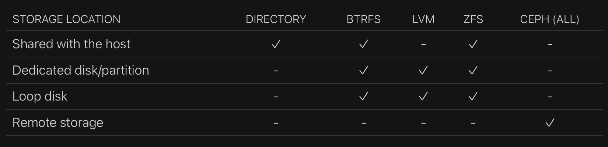

# LXD Storage and Backups

Sources:

- ✅ [LXD Storage explainer](https://documentation.ubuntu.com/lxd/en/latest/explanation/storage/)
- ✅ [LXD Storage backends](https://stgraber.org/2016/03/15/lxd-2-0-installing-and-configuring-lxd-212/)

LXD stores its data in **storage pools**, divided into **storage volumes** of different **content types** (like images or instances). You could think of a storage pool as the disk that is used to store data, while storage volumes are different partitions on this disk that are used for specific purposes.

> In addition to storage volumes, there are storage buckets, which use the Amazon S3 protocol. Like storage volumes, storage buckets are part of a storage pool. They must be manually configured.

Each storage pool uses a storage driver. The following storage drivers are supported:

- Directory - `dir`
- Btrfs - `btrfs`
- LVM - `lvm`
- ZFS - `zfs`
- Ceph RBD - `ceph`
- CephFS - `cephfs`
- Ceph Object - `cephobject`

> Note: nearly all storage drivers support some kind of optimizations. To make instance creation near instantaneous, LXD clones a pre-made image volume when creating an instance rather than unpacking the image tarball from scratch. LXD uses this optimized transfer when transferring instances and snapshots between storage pools that use the same storage driver, if the storage driver supports optimized transfer and the optimized transfer is actually quicker. Otherwise, LXD uses rsync to transfer container and file system volumes, or raw block transfer to transfer virtual machine and custom block volumes.

LXD creates a storage pool during initialization. You can add more storage pools later, using the same driver or different drivers. Unless specified otherwise, LXD sets up **loop-based storage** with a sensible default size (20% of the free disk space, but at least 5 GiB and at most 30 GiB).

Depending on the selected storage driver various storage locations are supported:


> The default configuration uses loop disk. Such configuration suffers from performance penalties. The loop files reside in `/var/snap/lxd/common/lxd/disks/` if you are using the snap, or in `/var/lib/lxd/disks/` otherwise. Loop files can not be shrunk.

> **The recommended storage driver is ZFS.** Whenever possible, you should dedicate a full disk or partition to your LXD storage pool. The other best option is Btrfs. They have similar functionalities, but ZFS is more reliable. With ZFS, launching a new container is fast because the filesystem starts as a copy on write clone of the images’ filesystem.


## Storage Volumes and Content Types

Storage volume types:

- `container/virtual-machine`:
    LXD automatically creates one of these storage volumes when you launch an instance. It is used as the root disk for the instance, and it is destroyed when the instance is deleted.

- `image`:
    LXD automatically creates one of these storage volumes when it unpacks an image to launch one or more instances from it. You can delete it after the instance has been created. If you do not delete it manually, it is deleted automatically ten days after it was last used to launch an instance.

- `custom`:
    You can add one or more custom storage volumes to hold data that you want to store separately from your instances (e.g., backups). Custom storage volumes can be shared between instances, and they are retained until you delete them.

Content types:

- `filesystem`:
    This content type is used for containers and container images. It is the default content type for custom storage volumes. Can be simultaneously shared between systems.

- `block`:
    This content type is used for virtual machines and virtual machine images. You can create a custom storage volume of type block by using the --type=block flag. They should not be shared between instances, because simultaneous access can lead to data corruption.

- `iso`:
    This content type is used for custom ISO volumes. A custom storage volume of type iso can only be created by importing an ISO file using lxc import. Custom storage volumes of content type iso can only be attached to virtual machines.


## Exploring Default Installation (ZFS on Loop)

By default LXD initialization settings, a file-backed zpool will be created automatically.

If you opted for the ZFS backing store you may install ZFS userland tools and investigate the created zpool and volumes.

```bash
sudo apt install zfsutils-linux
sudo zpool list
sudo zfs list
```

Where does this ZFS pool reside? The default LXD initialization settings configure a `default.img` loop file:

```bash
sudo ls /var/snap/lxd/common/lxd/disks
```

## Sharing Filesystems Between Host and Guest

If using ZFS we can share the container's filesystem to host by manually mounting it:

```bash
# check if zfs mountpoint is set
sudo zfs get mountpoint default/containers/first
# legacy indicated manal mounting is available
sudo mount -t zfs default/containers/first /mnt
```

We can also use LXD's SSHFS mounting into a local path on your client:

```bash
sudo apt install sshfs
sudo lxc file mount <instance_name>/<path_to_directory> <local_location> # may require sudo
sudo ls <local_location>
```

Alternatively, to share a file/directory from host to guest an additional disk device can be added. For instance, to mount host /opt in container at /opt, you could add a disk device:

```
touch /opt/sample_file
lxc config device add <container_name> <device_name> disk source=/opt path=opt
lxc shell first
lsblk
ls /opt
```


## Managing Storage Pools

Sources:

- ✅ [Create storage pool](https://documentation.ubuntu.com/lxd/en/latest/howto/storage_pools/#storage-create-pool)


### List, Create, Configure, Resize

**List**

To list LXD storage pools and their source location and additional data, use:

```
lxc storage list
lxc storage show <pool_name>
lxc storage info <pool_name>
```

**Create**

To create a storage pool, use the following command:
- `lxc storage create <pool_name> <driver> [configuration_options...]`

Examples for directory-based storage:
- Create a directory pool named pool1:
    - `lxc storage create pool1 dir`
- Use the existing directory /data/lxd for pool2:
    - `mkdir -p /data/lxd`
    - `lxc storage create pool2 dir source=/data/lxd`

> Note: other storage drivers may require more configuration; ZFS example below:
> - Create a loop-backed pool named pool1 (the ZFS zpool will also be called pool1):
>     - `lxc storage create pool1 zfs`
> - Create a loop-backed pool named pool2 with the ZFS zpool name my-tank:
>     - `lxc storage create pool2 zfs zfs.pool_name=my-tank`

> View more examples [here](https://documentation.ubuntu.com/lxd/en/latest/howto/storage_pools/#storage-create-pool)

**Configure**

Refer to the [driver configuration options](https://documentation.ubuntu.com/lxd/en/latest/reference/storage_drivers/#storage-drivers).

Use the following command to set configuration options for a storage pool:
- `lxc storage set <pool_name> <key> <value>`

For example, to turn off compression during storage pool migration for a dir storage pool, use the following command:
- `lxc storage set my-dir-pool rsync.compression false`

You can also edit the storage pool configuration by using the following command:
- `lxc storage edit <pool_name>`

**Resize**

If you need more storage, you can increase the size of your storage pool by changing the size configuration key:
- `lxc storage set <pool_name> size=<new_size>`

> This will only work for loop-backed storage pools that are managed by LXD. You can only grow the pool (increase its size), not shrink it.


### Set Container Instance Storage Pool

There is no concept of a default storage pool in LXD. When you create a storage volume, you must specify the storage pool to use.

When LXD automatically creates a storage volume during instance creation, it uses the storage pool that is configured for the instance. This configuration can be set in either of the following ways:

- Directly on an instance:
    - `lxc launch <image> <instance_name> --storage <storage_pool>`

- Through a profile:
    - `lxc profile device add <profile_name> root disk path=/ pool=<storage_pool>`
    - and `lxc launch <image> <instance_name> --profile <profile_name>`

- Through the default profile

In a profile, the storage pool to use is defined by the pool for the root disk device:
```
  root:
    type: disk
    path: /
    pool: default
```

In the default profile, this pool is set to the storage pool that was created during initialization.

To move an instance storage volume to another storage pool, make sure the instance is stopped. Then use the following command to move the instance to a different pool:
- `lxc move <instance_name> --storage <target_pool_name>`


## Manage Storage Volumes

Sources:

- ✅ [Manage storage volumes](https://documentation.ubuntu.com/lxd/en/latest/howto/storage_volumes/#howto-storage-volumes)

### List Volumes

To list all available storage volumes in a storage pool, use the following command:
- `lxc storage volume list <pool_name>`
- `lxc storage volume show <pool_name> [<volume_type>/]<volume_name>`
- `lxc storage volume info <pool_name> [<volume_type>/]<volume_name>`

> Example: `lxc storage volume show default container/first`

### Create Volumes and Add to Guest

To specify instance rootdisk size during creation:
- `lxc launch ubuntu:22.04 ubuntu-big --device root,size=3GiB`

You can add custom storage volumes to your instances. Such custom storage volumes are independent of the instance, which means that they can be backed up separately and are retained until you delete them. Custom storage volumes with content type `filesystem` (default) can also be shared between different instances.

Use the following command to create a custom storage volume of type block or filesystem in a storage pool:
- `lxc storage volume create <pool_name> <volume_name> [configuration_options...]`

> Example: `lxc storage volume create default myvol size=1GiB`

After creating a custom storage volume, you can add it to one or more instances as a disk device. For custom storage volumes with the content type filesystem, use the following command, where <location> is the path for accessing the storage volume inside the instance (for example, /data):
- `lxc storage volume attach <pool_name> <filesystem_volume_name> <instance_name> [device_name] <location>`

> Note: The lxc storage volume attach command is a shortcut for adding a disk device to an instance. 

Alternatively, you can add a disk device for the storage volume in the usual way:
- `lxc config device add <instance_name> <device_name> disk pool=<pool_name> source=<volume_name> [path=<location>]`

> Note: When you attach a storage volume to an instance as a disk device, you can configure I/O limits for it. To do so, set the limits.read, limits.write or limits.max properties to the corresponding limits. This is implemented using blkio cgroups. Example: `lxc config device set first opt_device limits.read=4MiB`

### Configure Volumes

Use the following command to set configuration options for a storage volume:
- `lxc storage volume set <pool_name> [<volume_type>/]<volume_name> <key> <value>`

For example, to set the size of your custom storage volume my-volume to 1 GiB, use the following command:
- `lxc storage volume set my-pool my-volume size=1GiB`

You can also edit the storage volume configuration by using the following command:
- `lxc storage volume edit <pool_name> [<volume_type>/]<volume_name>`

### Resize Volumes

If you need more storage in a volume, you can increase the size of your storage volume. In some cases, it is also possible to reduce the size of a storage volume.

To resize a storage volume, set its size configuration:
- `lxc storage volume set <pool_name> <volume_name> size <new_size>`

> Shrinking only works for filesystem-type volumes.

To resize a rootfs for a container, override the default profile settings for a `root` device:
- `lxc config device override <container_name> root size=<X>GiB`

### Move and Copy Volumes

Use the following command to copy a custom storage volume:
- `lxc storage volume copy <source_pool_name>/<source_volume_name> <target_pool_name>/<target_volume_name>`

> Add the --volume-only flag to copy only the volume and skip any snapshots that the volume might have. If the volume already exists in the target location, use the --refresh flag to update the copy.

> It is also possible to copy volumes across LXD servers by specifying <remote:> before pool names.

Use the following command to move or rename a storage volume:
- `lxc storage volume move <source_pool_name>/<source_volume_name> <target_pool_name>/<target_volume_name>`

Alternatively, use the following command to move the instance to a different pool:
- `lxc move <instance_name> --storage <target_pool_name>`

> Before you can move or rename a custom storage volume, all instances that use it must be stopped.

### Backup Volumes

There are different ways of backing up your custom storage volumes:

- Use snapshots for volume backup
- Use export files for volume backup
- Copy custom storage volumes

Which method to choose depends both on your use case and on the storage driver you use. In general, **snapshots are quick and space efficient** (depending on the storage driver, dir snapshots are slow), but they are stored in the same storage pool as the volume and therefore not too reliable. 

**Create snapshot**

Use the following command to create a snapshot for a custom storage volume:
- `lxc storage volume snapshot <pool_name> <volume_name> [<snapshot_name>]`

> Add the --reuse flag in combination with a snapshot name to replace an existing snapshot.

> By default, snapshots are kept forever, unless the snapshots.expiry configuration option is set. To retain a specific snapshot even if a general expiry time is set, use the --no-expiry flag.

You can use periodic snapshots. For example, to configure daily snapshots, use the following command:
- `lxc storage volume set <pool_name> <volume_name> snapshots.schedule @daily`

> When scheduling regular snapshots, consider setting an automatic expiry (snapshots.expiry) and a naming pattern for snapshots (snapshots.pattern)

> If using ZFS you can view and create snapshots with:
>   ```
>   sudo zfs snapshot default/containers/first@my_snap
>   sudo zfs list -t snapshot
>   ```

**Restore snapshot**

To restore, you must **first stop all instances that use the storage volume**. Then use the following command:
- `lxc storage volume restore <pool_name> <volume_name> <snapshot_name>`

You can also restore a snapshot into a new custom storage volume, either in the same storage pool or in a different one (even a remote storage pool). To do so, use the following command:
- `lxc storage volume copy <source_pool_name>/<source_volume_name>/<source_snapshot_name> <target_pool_name>/<target_volume_name>`

**Manage snapshots**

Snapshot management is analogous to volume management.

- `lxc storage volume info <pool_name> <volume_name>`
- `lxc storage volume show <pool_name> <volume_name>/<snapshot_name>`
- `lxc storage volume edit <pool_name> <volume_name>/<snapshot_name>`
- `lxc storage volume delete <pool_name> <volume_name>/<snapshot_name>`

**Back up to file**

You can export the full content of your custom storage volume to a standalone file that can be stored at any location. For highest reliability, store the backup file on a different file system to ensure that it does not get lost or corrupted.

Use the following command to export a custom storage volume to a compressed file (for example, /path/to/my-backup.tgz):
- `lxc storage volume export <pool_name> <volume_name> [<file_path>]`

> --optimized-storage can export storage-driver-specific binary blob (zfs), while --volume-only skips exporting volume snapshots

**Restore from file**

You can import an export file (for example, /path/to/my-backup.tgz) as a new custom storage volume. To do so, use the following command:
- `lxc storage volume import <pool_name> <file_path> [<volume_name>]`

