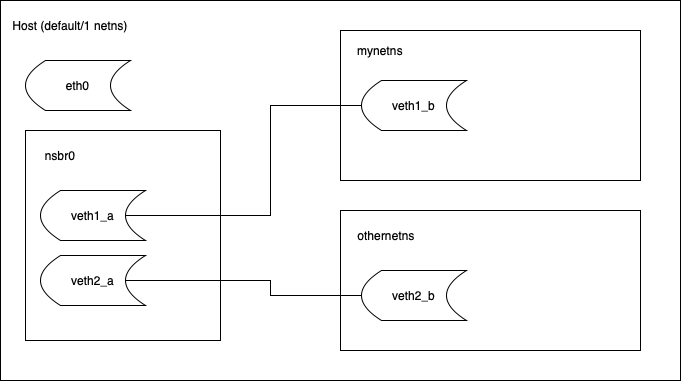

# LXD Networking and WebGUI

Sources:

- ✅ [LXD Networks explaner](https://documentation.ubuntu.com/lxd/en/latest/explanation/networks/)
- ✅ [LXD Networks](https://documentation.ubuntu.com/lxd/en/latest/networks/)


## LXD Networking Basics

There are different ways to connect your instances to the Internet. The easiest method is to have LXD create a network bridge during initialization and use this bridge for all instances, but **LXD supports many different and advanced setups for networking**.

LXD supports various network types:
- `bridged`: Uses an existing bridge on the host and creates a virtual device pair to connect the host bridge to the instance.
- `macvlan`: Sets up a new network device based on an existing one, but using a different MAC address.
- `sriov`: Passes a virtual function of an SR-IOV-enabled physical network device into the instance.
- `physical`: Passes a physical device from the host through to the instance. The targeted device will vanish from the host and appear in the instance.
- `ovn`: Uses an existing OVN network and creates a virtual device pair to connect the instance to it.
- `ipvlan`: Sets up a new network device based on an existing one, using the same MAC address but a different IP.
- `p2p`: Creates a virtual device pair, putting one side in the instance and leaving the other side on the host.
- `routed`: Creates a virtual device pair to connect the host to the instance and sets up static routes and proxy ARP/NDP entries to allow the instance to join the network of a designated parent interface.

Network types are generally divided in two categories:
- `managed networks`
- `external networks`

**Managed networks**

Managed networks in LXD are created and configured with the lxc network \[create|edit|set\] command. Depending on the network type, LXD either fully controls the network or just manages an external network interface.

**Fully controlled networks** create network interfaces and provide most functionality, including, for example, the ability to do **ACLs, forwards, load balancers, zones, and IP management**.

LXD supports the following fully managed network types:

- `bridge`: The default network type. In LXD context, the bridge network type creates an L2 bridge that connects the instances that use it together into a single network L2 segment. This makes it possible to pass traffic between the instances. **The bridge can also provide local DHCP and DNS.**

- `ovn`: software-defined open virtual network; In LXD context, the ovn network type creates a logical network. To set it up, you must install and configure the OVN tools. In addition, you must create an uplink network that provides the network connection for OVN. As the uplink network, you should use one of the external network types or a managed LXD bridge.

**External networks**

External networks use network interfaces that already exist. Therefore, LXD has limited possibility to control them, and LXD features like network ACLs, network forwards and network zones are not supported.

The main purpose for using external networks is to provide an uplink network through a parent interface. This external network specifies the presets to use when connecting instances or other networks to a parent interface.

LXD supports the following external network types:

- `macvlan` is a virtual LAN that you can use if you want to assign several IP addresses to the same network interface, basically splitting up the network interface into several sub-interfaces with their own IP addresses. You can then assign IP addresses based on the randomly generated MAC addresses. In LXD context, the macvlan network type provides a preset configuration to use when connecting instances to a parent macvlan interface.

- `SR-IOV` is a hardware standard that allows a single network card port to appear as several virtual network interfaces in a virtualized environment. In LXD context, the sriov network type provides a preset configuration to use when connecting instances to a parent SR-IOV interface.

- `physical network` type connects to an existing physical network, which can be a network interface or a bridge, and serves as an uplink network for OVN. It provides a preset configuration to use when connecting OVN networks to a parent interface.


## Fully Controlled Bridge Networks

**Bridge networks**

Which network type to choose depends on your specific use case. If you choose a fully controlled network, it provides more functionality than using a network device. The bridge is the default network type in LXD.

A network bridge creates a virtual L2 Ethernet switch that instance NICs can connect to, making it possible for them to communicate with each other and the host. LXD bridges can leverage underlying native Linux bridges and Open vSwitch.

The bridge network type allows to create an L2 bridge that connects the instances that use it together into a single network L2 segment. Bridges created by LXD are managed, which means that in addition to creating the bridge interface itself, LXD also sets up a local dnsmasq process to provide DHCP, IPv6 route announcements and DNS services to the network. By default, it also performs NAT for the bridge.

LXD creates a default `lxdbr0` bridge during initialization.
- `lxc network list`
- `lxc network info lxdbr0`

`bridge` networks support [numerous configuration options](https://documentation.ubuntu.com/lxd/en/latest/reference/network_bridge/) within the following config namespaces:
- `bgp` (BGP peer configuration)
- `bridge` (L2 interface configuration)
- `dns` (DNS server and resolution configuration)
- `fan` (configuration specific to the Ubuntu FAN overlay)
- `ipv4` (L3 IPv4 configuration)
- `ipv6` (L3 IPv6 configuration)
- `maas` (MAAS network identification)
- `security` (network ACL configuration)
- `raw` (raw configuration file content)
- `tunnel` (cross-host tunneling configuration)
- `user` (free-form key/value for user metadata)

**Bridged network devices**

The container network devices connecting to LXD host bridges are `nictype: bridged` network devices. A bridged NIC uses an existing bridge on the host and creates a virtual device pair to connect the host bridge to the instance.



`bridged` devices have [numerous configuration options](https://documentation.ubuntu.com/lxd/en/latest/reference/devices_nic/#devices-nic), including:
- `name` and `host_name`: interface names in instance and on the host
- `hwaddr`: The MAC address of the new interface
- `mtu`: The MTU of the new interface
- `ipv4.address`: An IPv4 address to assign to the instance through DHCP (can be none to restrict all IPv4 traffic when security.ipv4_filtering is set)
- `ipv4.routes`: Comma-delimited list of IPv4 static routes to add on host to NIC
- `limits.egress`: I/O limit in bit/s for outgoing traffic (various suffixes supported).
- `limits.ingress`: I/O limit in bit/s for incoming traffic (various suffixes supported).
- `security.ipv4_filtering`: Prevent the instance from spoofing another instance’s IPv4 address (enables security.mac_filtering)
- `security.mac_filtering`: Prevent the instance from spoofing another instance’s MAC address
- `vlan`: The VLAN ID to use for non-tagged traffic (can be none to remove port from default VLAN)

> The `bridged`, `macvlan` and `ipvlan` interface types can be used to connect to an existing physical network.
> 
> macvlan effectively lets you fork your physical NIC, getting a second interface that is then used by the instance. This method saves you from creating a bridge device and virtual Ethernet device pairs and **usually offers better performance than a bridge**.
> 
> The downside to this method is that **macvlan devices, while able to communicate between themselves and to the outside, cannot talk to their parent device** (you need an external reflector switch). This means that you can’t use macvlan if you ever need your instances to talk to the host itself.
> 
> In such case, a bridge device is preferable. A bridge also lets you use MAC filtering and I/O limits, which cannot be applied to a macvlan device.
> 
> `ipvlan` is similar to `macvlan`, with the difference being that the forked device has IPs statically assigned to it and inherits the parent’s MAC address on the network.

## Managing LXD Networks

### List, View, Create, Delete

List using:
- `lxc network list`

View network info:
- `lxc network info lxdbr0`

List all network allocations and leases:
- `lxc network list-allocations`
- `lxc network list-leases <network>`

**Create a new network**
- `lxc network create mbr0`

**Delete a network**
- `lxc network delete mbr0`


### Configure

Edit network:
- `lxc network edit mbr0`

**Or set configuration parameters via command line:**
- `lxc network set mbr0 ipv4.address=10.0.0.1/24`


### Example: Port Forwarding

> Note: you may need to configure any existing firewalls: https://documentation.ubuntu.com/lxd/en/latest/howto/network_bridge_firewalld/#network-bridge-firewall

**Using `iptables`**

Add port forward rule:
- `sudo iptables -t nat -A PREROUTING -p tcp --dport 80 -j DNAT --to-destination <container_ip>`

Remove port forward rule:
- `sudo iptables -t nat -L -n --line-numbers`
- `sudo iptables -t nat -D PREROUTING <number>`

**Using LXD**

Use `lxd network forward` command to either forward all traffic:
- `lxc network forward create <network_name> <listen_address> [target_address=<ip>] [configuration_options...]`
- example `lxc network forward edit lxdbr0 10.211.55.5`

and set a default target address (forward all unmapped ports):
- `lxc network forward set lxdbr0 10.211.55.5 target_address=10.7.155.2`

or port-forward specific ports only:
- `lxc network forward port add <network_name> <listen_address> <protocol> <listen_ports> <target_address> [<target_ports>]`


> Note: If using LXD's NAT and your containers do not have network connectivity or port forwards to them do not work, make sure to reconfigure LXD bridge to use the correct host interface as gateway.
> ```bash
> # Sample config for lxdbr0
> lxc network set lxdbr0 ipv4.nat true
> lxc network set lxdbr0 ipv4.nat.address <HOST_GW_IFACE_IP> # This command is undocumented in older versions of LXD
> ```

### Example: Masquerading Guest IP

> This is done by default if using lxdbr0

Enable IP forwarding and set up NAT using masquerade rule to enable Internet connectivity:

```bash
sudo echo 1 > /proc/sys/net/ipv4/ip_forward # enable ip forwarding
sudo iptables -t nat -A POSTROUTING -o eth0 -j MASQUERADE # masquerade
```


## Managing Instance Network Devices

### List and Create Network Devices

To grant direct network access to an instance, you must assign it at least one network device, also called NIC. You can configure the network device in one of the following ways:

- Use the default network bridge that you set up during the LXD initialization. This method is used if you do not specify a network device for your instance.Check the default profile to see the default configuration:
    - `lxc profile show default`

- Use an existing network interface by adding it as a network device to your instance. This network interface is outside of LXD control. Therefore, you must specify all information that LXD needs to use the network interface.
Use a command similar to the following:
    - `lxc config device add <instance_name> <device_name> nic nictype=<nic_type> ...`
    - example: `lxc config device add <instance_name> eth0 nic nictype=bridged parent=br0`

- **Create a managed network and add it as a network device to your instance. With this method, LXD has all required information about the configured network, and you can directly attach it to your instance as a device:**
    - `lxc network attach <network_name> <instance_name> <device_name>`
    - example `lxc network attach mbr0 <container> mbr0 eth1`

### Instance NIC Configuration

Ubuntu instances >= 18.04 use `netplan` for network configuration (`/etc/netplan`) ready for `cloud-init` by default. Therefore, old `net-tools` interface file `/etc/network/interfaces` is not present.

The recommended configuration for **managed networks and profile-default network devices** is to assign addresses to instance NICs using LXDs DHCP reservation:
- `lxc config device override <instance> <device> ipv4.address=...`

This will copy the NIC configuration from the default profile and override it in the container-specific configuration, view with `lxc config show ubi`

```
...
devices:
  eth0:
    ipv4.address: ...
    name: eth0
    network: lxdbr0
    type: nic
...
```

For other managed network devices you can use set instead of override (this does not edit the netplan configuration inside the guest, rather it sets an outside parameter and reserves a DHCP address):
- `lxc config device <container> <nic> set ipv4.address=X.X.X.X`
- example `lxc config device set <container> mbr0 ipv4.address=10.0.0.2`

You may use in-container network tools, such as `netplan` to configure networking in an instance. To do so you can edit the default netplan config file `/etc/netplan/50-cloud-init.yaml`:

```
network:
    version: 2
    ethernets:
        eth0:
            dhcp4: true
            dhcp4-overrides:
                route-metric: 100
        eth1:
            dhcp4: true
            dhcp4-overrides:
                route-metric: 200
```

When done, apply the configuration using:
- `netplan apply`

Review netplan config:
- `netplan info`
- `netplan ip leases eth0 # for dhcp lease review`

Alternatively set a static IP address, routes, and DNS in the netplan config:

```
network:
    version: 2
    ethernets:
        eth0:
            dhcp4: true
            dhcp4-overrides:
                route-metric: 100
        eth1:
            addresses:
                - 10.0.0.10/24
                - 10.0.0.20/24
            routes:
                - to: default
                  via: 10.0.0.1
                  metric: 200
            nameservers:
                search:
                    - "mycompany.local"
                addresses:
                    - 10.0.0.1
                    - 1.1.1.1
```

or manually set using `netplan` or `ip` tools.


## Networking Example: Configure VLANs

Enable vlan filtering on our mbr0 bridge:
- `ip link set dev mbr0 type bridge vlan_filtering 1`

Add instances to vlan:
- `lxc config device set ct1 mbr0 vlan=10`
- `lxc config device set ct2 mbr0 vlan=10`
- `lxc config device set ct3 mbr0 vlan=30`

Set native vlan:
- `bridge vlan add dev mbr0 vid 10 pvid untagged self`
- `bridge vlan show`

- Try to ping ct1->ct2
- Try to ping ct2->ct3


## Network Debugging

Useful tools:
- `nc -l`
- `tcpdump -i eth0 icmp`
- `wireshark`
- `burpsuite`


## LXD WebUI

Sources:

- ✅ [How to access the LXD web UI](https://documentation.ubuntu.com/lxd/en/latest/howto/access_ui/)

### LXD Server Configuration

By default, LXD is socket activated and configured to listen only on a local UNIX socket. While LXD may not be running when you first look at the process listing, any LXC command will start it up. For instance:
- `lxc list`

This will create your client certificate and contact the LXD server for a list of containers. To make the server accessible over the network you can set the http port using:
- `lxc config set core.https_address :8443`

> This will tell LXD to listen to port 8443 on all addresses.

Then enable the UI in the snap:
- `snap set lxd ui.enable=true`
- `sudo systemctl reload snap.lxd.daemon`

Try to access UI by visiting `https://<IP>:8443/`

Follow on-screen instructions to add client certificates. Attempt Private Browsing if your browser is not sending a client certificate.
