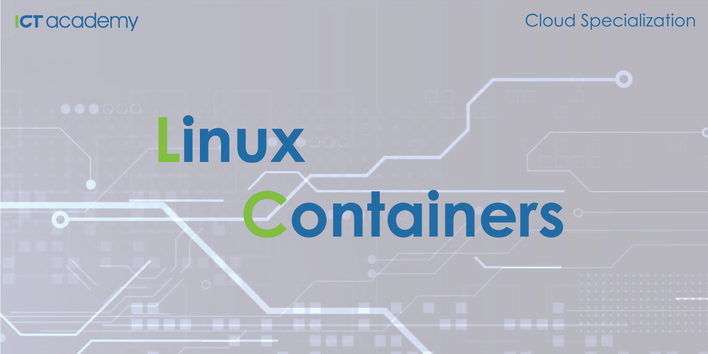

# Cloud Specialization: Linux Containers

  

    <em>Learn Linux Containers (LXC/LXD), the classic entry-level course for our Cloud Specialization series.</em>

---

**Live on-site course**: <a href="https://ict-academy.si/usposabljanje/linux-containers/" target="_blank">https://ict-academy.si/usposabljanje/linux-containers/</a>

**All courses**: <a href="https://ict-academy.si/" target="_blank">https://ict-academy.si/</a>

---

**What you'll learn**:
- Introduction to Linux Containers
- Installing and Running LXC
- LXC Management
- LXC Networking
- LXC Storage
- LXC Integration with Python
- LXC Practical examples
- LXD Introduction and Installation
- LXD Basic Usage
- LXD Storage and Backups
- LXD Networking and Web UI
- LXD Exercise and Advanced Topics

## Prerequisites
- Access to a workstation that has Linux installed
- Familiarity with the command line
- Basic understanding of the Cloud and networking

## Full Course Outline

### [Introduction to Linux Containers](./01_Introduction_to_Linux_Containers/README.md)
- Containerization vs traditional virtualization
- Introduction to Linux Containers
- Container Definition
- What types of containers are there?
- Container History
- LXC and linuxcontainers.org
- What is LXD?
- Docker vs Linux Containers
- Features to Enable Containers

### [Installing and Running LXC](./02_Installing_and_Running_LXC/README.md)
- Introduction
- Releases
- Installation
- LXC Default Configuration
- Privileged LXC containers
- Building a LXC container
- Unprivileged LXC containers

### [LXC Management](./03_LXC_Management/README.md)
- Autostart LXC containers
- Freezing a running container
- LXC Lifecycle management hooks
- Limiting container resource usage
- Troubleshooting
- Security

### [LXC Networking](./04_LXC_Networking/README.md)
- Default networking
- Using dnsmasq service to obtain an IP address in the container
- Giving a container a persistent IP address
- Making a container publicly accessible
- Connecting LXC to the host network
- Configuring LXC using none network mode
- Configuring LXC using empty network mode
- Configuring LXC using veth mode
- Configuring LXC using phys mode
- Configuring LXC using ipvlan mode
- Configuring LXC using macvlan mode

### [LXC Storage](./05_LXC_Storage/README.md)
- Attaching directories from the host OS
- Backing Stores
- Creating container backup using lxc-copy
- Snapshots
- Passing devices to a running container

### [LXC Integration with Python](./06_LXC_Integration_with_Python/README.md)
- Python bindings
- Installation and setup
- Build and start a container
- Updating all running containers
- Stop and destroy all containers
- Run a Python script inside a container

### [LXC Practical examples](./07_LXC_Practical_examples/README.md)
- OpenWRT container with public access

### [LXD Introduction and Installation](./08_LXD_Introduction_and_Installation/README.md)
- LXD Introduction
    - Releases
    - About LXD and LXC
    - LXD Daemon and LXD Client
    - LXD Containers and Virtual Machines
- LXD Installation and Initialization
    - LXD Installation
    - LXD Initialization

### [LXD Basic Usage](./09_LXD_Basic_Usage/README.md)
- LXD Images and Image Servers
- Running Your First System Container with LXD
- Interacting with Containers
- LXD Profiles and Container Configuration
    - Container Configuration
    - Profiles
- Managing Container Instances
    - Back up
    - Snapshots
    - Backup/Restore to/from File (Export/Import)
    - Copying or Moving Containers
    - Create, Manage and Publish Images
- Logs and Troubleshooting

### [LXD Storage and Backups](./10_LXD_Storage_and_Backups/README.md)
- Storage Volumes and Content Types
- Exploring Default Installation (ZFS on Loop)
- Sharing Filesystems Between Host and Guest
- Managing Storage Pools
    - List, Create, Configure, Resize
    - Set Container Instance Storage Pool
- Manage Storage Volumes
    - List Volumes
    - Create Volumes and Add to Guest
    - Configure Volumes
    - Resize Volumes
    - Move and Copy Volumes
    - Backup Volumes

### [LXD Networking and Web UI](./11_LXD_Networking_and_WebUI/README.md)
- LXD Networking Basics
- Fully Controlled Bridge Networks
- Managing LXD Networks
    - List, View, Create, Delete
    - Configure
    - Example: Port Forwarding
    - Example: Masquerading Guest IP
- Managing Instance Network Devices
    - List and Create Network Devices
    - Instance NIC Configuration
- Networking Example: Configure VLANs
- Network Debugging
- LXD WebUI
    - LXD Server Configuration

### [LXD Exercise and Advanced Topics](./12_LXD_Exercise_and_Advanced_Topics/README.md)
- Exercise
    - LXD Example: OpenWRT with Luci
- Resources for Advanced Topics
    - Clustering
    - Security
    - Running Docker in LXD
    - Device passthrough
    - Nesting, Limits, and Privileged Containers
    - UID Mappings and Privileged Containers
    - Booting Containers with Kernel Command Line Parameters

## Sources
- [Container and virtualization tools](https://linuxcontainers.org/)
- [What's a Linux container?](https://www.redhat.com/en/topics/containers/whats-a-linux-container)
- Containerization with LXC, Konstantin Ivanov, 2017
- Practical LXC and LXD, Senthil Kumaran S., 2017

## Changes
- Version `v1.0.0`: 2.10.2025 - Initial release
